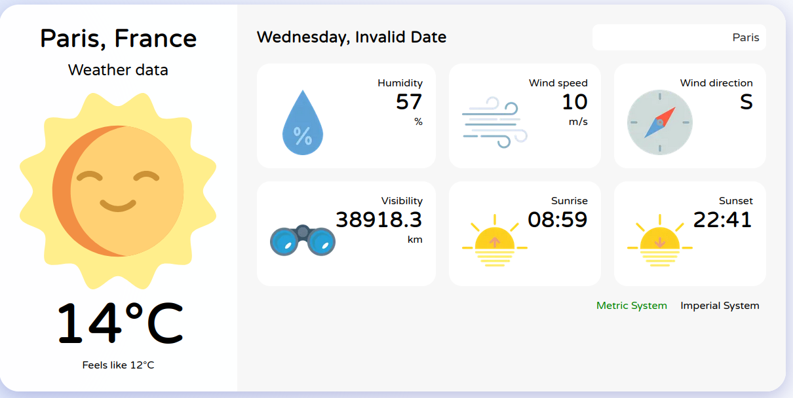

[[_TOC_]]

# Weather App by Maria

Ce projet météo représente ma candidature pour la formation **Concepteur Développeur d'Applications-Eco**, proposée par l'organisme de fornation **Simplon**.

Voici l'affichage finale du site :  



## Fonctionnalités

1. Recherche des villes 

2. Affichage de la date ( __partiellement fonctionnelle__ )

3. Température et humidité

4. Vitesse du vent et sa direction

5. Levé et couché du soleil

6. Metric vs Imperial system

7. Message d'erreur lors du chargement d'informations

## Installation

1. `git clone https://github.com/mariavlad75/SimplonWeather.git`

2. `cd weather-app`

3. `npm install`

4. `npm run dev`

## Arboresence du site
<details>
    <summary>Détail de l'arborescence du site</summary>
    
```bash
.
├── components
│   ├── ContentBox.js
│   ├── ContentBox.module.css
│   ├── DateAndTime.js
│   ├── DateAndTime.module.css
│   ├── ErrorScreen.js
│   ├── ErrorScreen.module.css
│   ├── Header.js
│   ├── Header.module.css
│   ├── LoadingScreen.js
│   ├── MainCard.js
│   ├── MainCard.module.css
│   ├── MetricsBox.js
│   ├── MetricsBox.module.css
│   ├── MetricsCard.js
│   ├── MetricsCard.module.css
│   ├── Search.js
│   ├── Search.module.css
│   ├── UnitSwitch.js
│   └── UnitSwitch.module.css
├── img
│   └── Site.png
├── node_modules
├── package.json
├── package-lock.json
├── pages
│   ├── api
│   │   └── data.js
│   ├── _app.js
│   └── index.js
├── public
│   ├── favicon.ico
│   └── icons
│       ├── 01d.svg
│       ├── 01n.svg
│       ├── 02d.svg
│       ├── 02n.svg
│       ├── 03d.svg
│       ├── 03n.svg
│       ├── 04d.svg
│       ├── 04n.svg
│       ├── 09d.svg
│       ├── 09n.svg
│       ├── 10d.svg
│       ├── 10n.svg
│       ├── 11d.svg
│       ├── 11n.svg
│       ├── 13d.svg
│       ├── 13n.svg
│       ├── 50d.svg
│       ├── 50n.svg
│       ├── binocular.png
│       ├── compass.png
│       ├── humidity.png
│       ├── sunrise.png
│       ├── sunset.png
│       └── wind.png
├── README.md
├── services
│   ├── converters.js
│   └── helpers.js
├── styles
│   ├── globals.css
│   └── Home.module.css
```
</details>

### Tips en cas d'erreur
Lors de mon développement, j'ai rencontrée quelques erreurs liées à l'utilisation de <mark> NodeJS </mark>.

Voici un ensemble de commandes qui peuvent vous aider :  

En cas d'erreur lors du build (```npm run dev```)
```bash
rm -rf node_modules package-lock.json
```

Puis réinstaller nodejs en version 18 :
```bash
npm install react@18 react-dom@18~
```

Puis on réinstalle les package nécessaire pour le bon fonctionnement du site web :
```bash
npm install
```

Puis on lance le site via la commande suivante : 
```bash
npm run dev
```

## Contributions

Any feature requests and pull requests are welcome!

## License

The project is under [MIT license](https://choosealicense.com/licenses/mit/).


